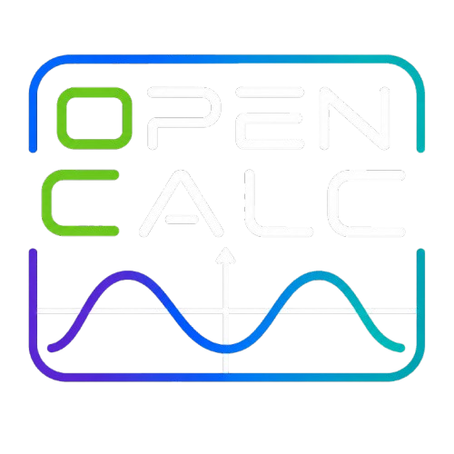

<p align="center">
  
</p>

OpenCalc is an open-source graphing calculator inspired by the TI-84, built around an ESP32-S3, a color LCD, USB-C, Python-style scripting, games, and expandable firmware.

OpenCalc-authored software is licensed under **GPL-3.0-or-later**. Bundled components retain their original licenses; see [Third-Party Notices](THIRD_PARTY_NOTICES.md).

The calculator runs **OpenCalc OS**, the project’s open-source ESP32-S3 operating environment. OpenCalc OS includes the calculator interface, math and graphing engines, built-in apps, scripting runtime, USB file storage, keypad handling, display drivers, game support, and power management.

Blog: [https://corypearl.github.io/opencalc/blog.html](https://corypearl.github.io/opencalc/blog.html)

<p align="center">
  <a href="hardware/pcb/opencalc_pcb_V5/img/opencalc_case_spin.gif"></a>
<a href="hardware/pcb/opencalc_pcb_V5/img/opencalc_pcb_V5_full.png"></a>
<a href="firmware/open_calc_ui_calculator_demo.gif"></a>

</p>
<p align="center"><small>Click an image to enlarge. The UI tour visits all 12 apps and the game menu.</small></p>

## Highlights

- **A real graphing calculator:** textbook-style input, exact and numerical
  math, complex numbers, calculus, history, persistent variables, and
  unit-aware expressions such as `8 m / 2 s`.
- **Integrated CAS and graphing:** Giac/KhiCAS symbolic math linked to Cartesian,
  parametric, polar, and sequence graphs, tables, roots, derivatives, tangents,
  integrals, and points of interest.
- **A complete math toolkit:** Statistics, Lists, Matrices, Solver, Finance,
  Conics, Inequalities, and a searchable science and engineering reference.
- **Reference Center:** press `Alpha` + `Zoom` for an interactive periodic table
  and browsable math, physics, and engineering formulas and explanations.
- **Programmable on the device:** edit, run, upload, and debug Tiny Python programs with
  calculator math, graphics, keys, storage, audio, and hardware APIs.
- **[Built for science and electronics](guied.MD#scientific-data-logging):** use Tiny Python,
  12 bidirectional digital pins, four 16-bit analog inputs, and shared I2C to
  control experiments, plot live sensor data, and analyze recordings in Stats.
- **Games included:** press `Alpha` + `2nd` for Tetris, Doom, Snake, Breakout, and NES/Mario support with
  persistent high scores, multi-key controls, and optional audio.
- **Open hardware:** ESP32-S3, 320x240 color display, diode-isolated keypad,
  rechargeable battery, USB-C, expandable storage, and a documented V5 PCB.
- **One-cable workflow:** the same USB-C connection handles charging, firmware
  flashing, serial monitoring, and file storage.
- **Dual-core OpenCalc OS:** one core keeps the interface and graphics responsive
  while the other handles background math and system work, with persistent
  worksheets, configurable performance, and power-saving controls.

## Rough production Cost Estimate

| Cost area                           | Estimate per unit |
| ----------------------------------- | ----------------- |
| PCB electronics parts from BOM      | $11-$16           |
| 320x240 LCD                         | $5                |
| 3.7 V 2000 mAh Li-ion battery       | $3-$5             |
| Cheap keycaps / keypad plastics     | $2-$4             |
| 3d printed case                     | $3-$6             |
| PCB fabrication + SMT assembly      | $5-$9             |
| Bulk shipping / logistics allowance | $3-$6             |
| Estimated production cost           | $32-$51           |

## Project Layout

```text
firmware/   OpenCalc OS source for the ESP32-S3 calculator
hardware/   key layouts, graphics, PCB files, case files, and hardware docs
docs/       notes and project website files
```

## Quick Start

Install and activate ESP-IDF first; see Espressif's
[ESP32-S3 Get Started guide](https://docs.espressif.com/projects/esp-idf/en/latest/esp32s3/get-started/).
Then connect OpenCalc with a data-capable USB-C cable and build the firmware:

```console
cd firmware
idf.py build
```

Find the serial port created by OpenCalc:

| System  | Terminal       | Command                                        |
| ------- | -------------- | ---------------------------------------------- |
| macOS   | Terminal       | `ls /dev/cu.*`                                 |
| Linux   | Terminal       | `ls /dev/ttyACM* /dev/ttyUSB* 2>/dev/null`     |
| Windows | PowerShell     | `[System.IO.Ports.SerialPort]::GetPortNames()` |
| Windows | Command Prompt | `mode`                                         |

Look for a new USB serial device after connecting the calculator. Typical names
are `/dev/cu.usbmodemopencalc1` on macOS, `/dev/ttyACM0` on Linux, or `COM5` on
Windows. Replace `PORT` below with that complete name; do not type the word
`PORT` literally.

If automatic flashing does not enter the bootloader, hold **Boot**, tap
**Reset**, and then release **Boot**. Flash using the detected port:

```text
idf.py -p PORT flash
```

After OpenCalc restarts, find the port again because its name can change between
bootloader and normal operation. Start the serial monitor with the runtime port:

```text
idf.py -p PORT monitor
```

Press `Ctrl+]` to exit the monitor. The same USB-C cable supports flashing,
serial monitoring, storage, and charging.

## Documentation

- [Complete OpenCalc OS Guide](guied.MD): in-depth controls, app workflows, games, scripting, settings, build instructions, validation, and troubleshooting.
- [Firmware README](firmware/FIRMWARE_README.md): build settings, flashing, storage image, controls, apps, games, and firmware status.
- [App Status](firmware/APP_STATUS.md): implementation status for every OpenCalc OS app and game.
- [PCB README](hardware/pcb/PCB_README.md): current V5 PCB parts, pin map, power path, display, keypad, battery, audio, and bring-up checks.
- [Tiny Python README](firmware/main/components/tiny-python-readme.md): scripting runtime details.

## Current Status

OpenCalc is an advanced working prototype, not a production-complete calculator.
Display, keypad, USB, storage, power, core calculator/graphing flows, and all five
games have been exercised on current hardware. The Giac/KhiCAS-derived CAS and
the new asynchronous Tiny Python path build and pass their available host tests;
both still need broader long-running device validation. The largest remaining
risks are CAS heap/output edge cases, repeated script run/input/exit reliability,
99x99 matrix stress, specialized statistics workflows, sampled non-Cartesian
intersections, and final UI/LCD polish. See the [app-by-app status](firmware/APP_STATUS.md)
for the exact implemented boundary.

## Credits

- OpenCalc OS, hardware, and enclosure design: [Cory Pearl](https://github.com/CoryPearl).
- CAS engines: [Giac/Xcas](https://xcas.univ-grenoble-alpes.fr/) by Bernard Parisse and contributors, with the [KhiCAS](https://github.com/KhiCAS) ESP32 port lineage under GPL-3.0-or-later; [Eigenmath](https://github.com/georgeweigt/eigenmath) remains as a BSD-2-Clause fallback.
- Doom engine: id Software's GPL Doom source, Simon Howard's Chocolate Doom work, and [doomgeneric](https://github.com/ozkl/doomgeneric) by ozkl, under GPL-2.0-or-later notices.
- NES emulation: [Anemoia-ESP32](https://github.com/Shim06/Anemoia-ESP32) by Shim06 and contributors, under GPLv3.
- Platform: [Espressif ESP-IDF](https://github.com/espressif/esp-idf), TinyUSB, and the ESP LCD ILI9341 component under their respective licenses.
- Prototype project funding was provided in part by [PCBWay](https://pcbway.com).

Complete copyright, license, and game-data details are recorded in [THIRD_PARTY_NOTICES.md](THIRD_PARTY_NOTICES.md). Doom WADs and NES ROMs are separate game data and are not licensed under the OpenCalc firmware license.
