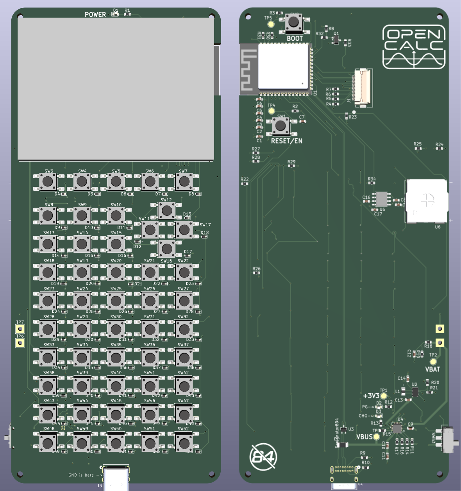
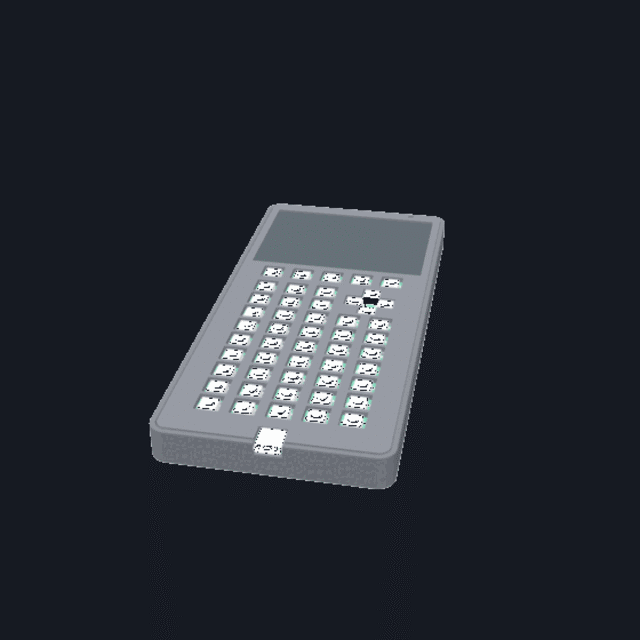
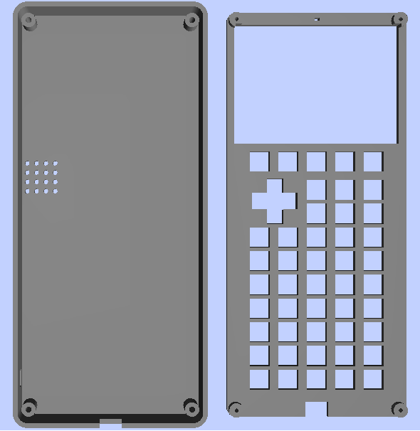
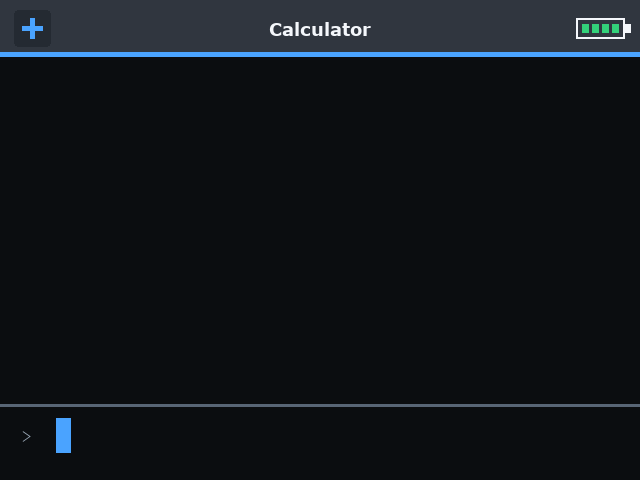

<h1>
  
</h1>

OpenCalc is an open-source graphing calculator inspired by the TI-84, built around an ESP32-S3, a color LCD, USB-C, Python-style scripting, games, and expandable firmware.

The calculator runs **OpenCalc OS**, the project’s open-source ESP32-S3 operating environment. OpenCalc OS includes the calculator interface, math and graphing engines, built-in apps, scripting runtime, USB file storage, keypad handling, display drivers, game support, and power management.

This project was partially funded by [PCBWay](https://pcbway.com).

Blog: [https://corypearl.github.io/opencalc/blog.html](https://corypearl.github.io/opencalc/blog.html)

<p align="center">
  
  <br>
  
  
  <br>
  
</p>

## Highlights

- ESP32-S3-WROOM-1-N16R8 with 16 MB flash and 8 MB PSRAM.
- 320x240 color ILI9341-style display.
- 10x5 keypad matrix with per-key diodes for multi-key input.
- One USB-C port for power, flashing/monitoring, and USB mass storage.
- 8 MB FAT storage partition for scripts, WAD files, NES ROMs, and user files.
- Python-style scripting through the built-in script app.
- TI-style calculator, graphing, table, matrix, stats, finance, conics, inequalities, settings, and app launcher screens.
- Game menu with Tetris, Doom, Snake, Breakout, and Mario work in progress.
- Optional new-PCB game audio through a PAM8302A speaker amp.
- Wi-Fi and Bluetooth available in hardware, disabled by default in firmware to save battery.
- Current PCB includes battery charging, battery monitoring, software-off sleep, a full power switch, and back-side test pads.

## Rough production Cost Estimate

| Cost area                           | Estimate per unit |
| ----------------------------------- | ----------------- |
| PCB electronics parts from BOM      | $11-$16           |
| 320x240 LCD                         | $5                |
| 3.7 V 2000 mAh Li-ion battery       | $3-$5             |
| Cheap keycaps / keypad plastics     | $2-$4             |
| 3d printed case                     | $3-$6             |
| PCB fabrication + SMT assembly      | $5-$9             |
| Bulk shipping / logistics allowance | $3-$6             |
| Estimated production cost           | $32-$51           |

## Project Layout

```text
firmware/   OpenCalc OS source for the ESP32-S3 calculator
hardware/   key layouts, graphics, PCB files, case files, and hardware docs
docs/       notes and project website files
```

## Quick Start

Plug the OpenCalc USB-C port into your computer. [ESP-IDF Get Started guide.](https://docs.espressif.com/projects/esp-idf/en/latest/esp32s3/get-started/).

```zsh
cd firmware
idf
idf.py build
```

Hold Boot, press Reset, then release both.

```zsh
idf.py flash
idf.py monitor
```

To list available serial ports if not auto found:

##### macOS:

```zsh
ls /dev/cu.*
```

##### Windows Command Prompt:

```cmd
reg query HKLM\HARDWARE\DEVICEMAP\SERIALCOMM
```

##### Windows PowerShell:

```powershell
Get-CimInstance Win32_SerialPort | Select-Object DeviceID,Description
```

## Documentation

- [Firmware README](firmware/FIRMWARE_README.md): build settings, flashing, storage image, controls, apps, games, and firmware status.
- [PCB README](hardware/pcb/PCB_README.md): current V5 PCB parts, pin map, power path, display, keypad, battery, audio, and bring-up checks.
- [Tiny Python README](firmware/main/components/tiny-python-readme.md): scripting runtime details.

## Current Status

OpenCalc is still prototype hardware and software. The current development focus is keeping OpenCalc OS booting into a usable calculator interface, stabilizing USB storage and scripts, improving graphing/math behavior, and making the PCB bring-up process predictable.

## Credits

Doom port in `firmware/main/components/doomgeneric` is based on [doomgeneric](https://github.com/ozkl/doomgeneric) by @ozkl.

NES emulator work in `firmware/main/components/mario` is based on [Anemoia-ESP32](https://github.com/Shim06/Anemoia-ESP32) by @Shim06, @jethomson, and @ferytell.

All other code and designs created by Cory Pearl.
