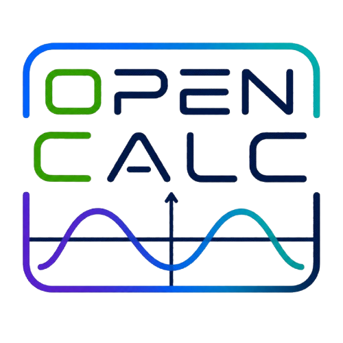
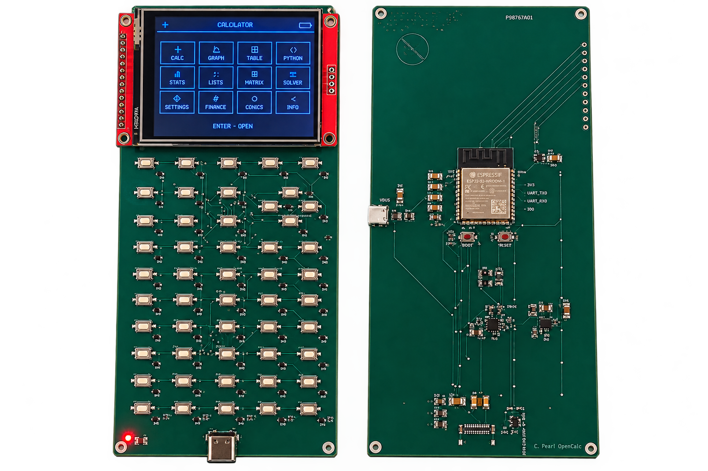
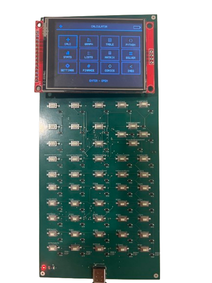
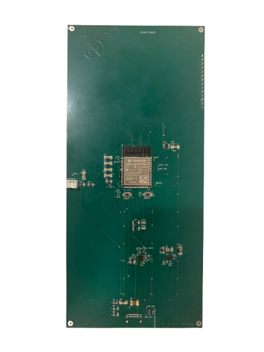

<h1>
  
  OpenCalc
</h1>

This project was partially funded by [PCBWay](https://pcbway.com) so I could test the OpenCalc PCB designs. They were easy to work with, communicated quickly, and helped make the current hardware prototype possible.

Blog: [https://corypearl.github.io/opencalc/blog.html](https://corypearl.github.io/opencalc/blog.html)

OpenCalc is an open-source graphing calculator inspired by the TI-84, but built around a faster ESP32-S3, a color LCD, USB-C, Python-style scripting, games, and expandable firmware.

The calculator runs **OpenCalc OS**, the project’s open-source ESP32-S3 operating environment. OpenCalc OS includes the calculator interface, math and graphing engines, built-in apps, Python-style scripting runtime, USB file storage, keypad handling, display drivers, and power management.

<p align="center">
  
  <br>
  

  <!--  -->
  <!--  -->
</p>

**First prototype PCB**

## Why OpenCalc Is Different

OpenCalc is meant to feel like a graphing calculator, but with more open hardware and a much more flexible firmware base than a closed classroom calculator.

- **ESP32-S3 processor:** dual-core 32-bit MCU running up to 240 MHz, giving the calculator far more general-purpose compute headroom than older calculator hardware.
- **More memory to build with:** the current target has 16 MB flash and 8 MB PSRAM, leaving room for graphics, scripting, menus, apps, and games.
- **8 MB user storage partition:** scripts, WAD files, NES ROMs, and other user files live in a FAT storage area exposed by the calculator.
- **Easy USB-C file access:** the current single USB-C connector supports power, flashing/monitoring over CDC serial, and USB mass storage named `opencalc`.
- **OpenCalc OS:** the calculator UI, math parser, graphing, keypad, storage, apps, PCB designs, and hardware behavior are open source.
- **Modern extras:** color LCD, USB mass storage, Python-style scripts, configurable app launcher, and optional games.

The current prototype includes:

- ILI9341 LCD output
- 10x5 button matrix support with per-key diodes for multi-key presses
- USB mass storage named `opencalc`
- flashed script/storage image support
- Python-style scripting - [README](firmware/main/components/tiny-python-readme.md)
- graphing calculator UI with calculator, graph, table, apps, settings, scripts, matrix, stats, finance, conics, and inequality graphing
- games menu with Tetris, Doom, Snake, Breakout, and Mario
- Wi-Fi and Bluetooth available in hardware, disabled by default in firmware to save battery

The next prototype:

- Smaller footprint LCD
- Speaker for sounds during games
- Bigger bittons
- More organized pcb
- Correct battery connector
- Smaller body
- Full case
- PCB imgs
- PCB labeled better
- Easier GND accsess
- Better antenna placment
- switch for full power off

Cost breakdown for the first prototype, single-board pricing before shipping and not including manufacturing:

- Board: about $7
- Soldered parts: about $34
- Battery: about $6
- Screen: about $6

The goal is to bring this down with a cleaner PCB and bulk assembly.

## User And Debug

Test pads are located on the back. The current hardware also has a front red power LED, a back green charging LED, and a back blue power-good LED.

Power off is software-only in the current firmware: `2nd` + `On` turns off the display/backlight and enters the configured low-power sleep path. It does not use a true battery cutoff latch.

Many OpenCalc OS settings live in [firmware/main/config.h](firmware/main/config.h), including Wi-Fi, Bluetooth, Doom, target FPS, testing-vs-PCB mode, storage flashing, CPU frequency, and power-save brightness caps.

## Games

Press `Alpha` then `2nd` to open the game menu. `2nd` then `Alpha` does not open it, and Alpha Lock should not trigger it.

| Calculator button        | Doom action               |
| ------------------------ | ------------------------- |
| Up / Down / Left / Right | Move                      |
| `Y=`                     | Fire                      |
| `Window`                 | Cycle weapons             |
| `Zoom`                   | Use / open doors          |
| `Trace`                  | Open / close automap      |
| `1`-`7`                  | Select weapon slot        |
| Hold `Mode`              | Run / sprint              |
| Hold `Stat` + Left/Right | Strafe                    |
| `Enter`                  | Menu/select               |
| `Back`                   | Escape/back               |
| `On (Home)`              | Quit Doom and return home |

| Calculator button        | Mario action                    |
| ------------------------ | ------------------------------- |
| Up / Down / Left / Right | Move                            |
| `Y=`                     | B / action                      |
| `Zoom`                   | A / jump                        |
| `Enter`                  | Start                           |
| `Back`                   | Select/back                     |
| `On (Home)`              | Quit Mario and return game menu |

| Calculator button | Tetris action               |
| ----------------- | --------------------------- |
| Left / Right      | Move piece                  |
| Down              | Soft drop                   |
| `Y=`              | Hard drop                   |
| `Window`          | Hold piece                  |
| Up                | Rotate                      |
| `Back`            | Pause/back                  |
| `On (Home)`       | Quit Tetris and return menu |

Other games:

- Snake
- Breakout

## Project Layout

```text
firmware/   OpenCalc OS source for the ESP32-S3 calculator
hardware/   key layouts, graphics, and hardware design files
docs/       notes and project website files
```

## Flash And Monitor

Plug the USB-C port into your computer.

From a fresh terminal:

```zsh
cd firmware
idf
idf.py build
idf.py flash
idf.py monitor
```

If the board is not already in download mode, hold Boot, press Reset, then release both.

If you need the specific port name, list available ports with:

```zsh
ls /dev/cu.*
```

On the current single-USB hardware, the monitor port usually appears as `/dev/cu.usbmodemopencalc1` when USB CDC is active.

See [firmware/FIRMWARE_README.md](firmware/FIRMWARE_README.md) for build, flash, USB storage, and game setup notes.
See [hardware/pcb/PCB_README.md](hardware/pcb/PCB_README.md) for info on the current PCB design.

## Status

This is still prototype hardware and OpenCalc OS software. The current goal is to keep the calculator booting directly into a usable interface, expose files over USB when connected to a computer, and continue filling out the TI-style apps with working implementations rather than placeholder screens.

## Plans

- Upgrade to esp32-s31 for even faster speeds
- Bigger battery
- Faster charging
- Full power off switch
- Continue improving ESP32-S3 performance and display throughput
- Reorganize and clean up the PCB
- Flesh out firmware features, apps, scripting, and game stability

## Credits

Doom port in `/doomgeneric` made by @ozkl on GitHub at [https://github.com/ozkl/doomgeneric](https://github.com/ozkl/doomgeneric)

NES emulator in `/mario` created by @Shim06, @jethomson, and @ferytell on GitHub at [https://github.com/Shim06/Anemoia-ESP32](https://github.com/Shim06/Anemoia-ESP32)

All other code and designs created by Cory Pearl.
